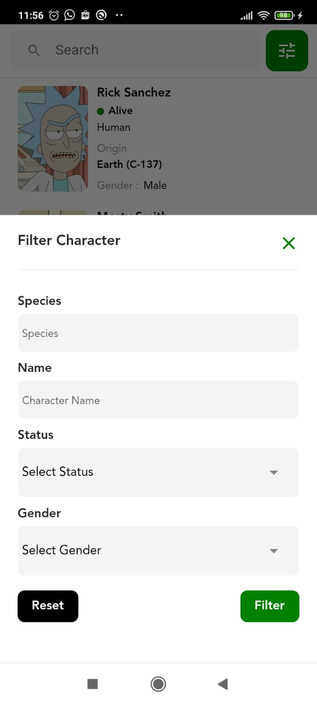
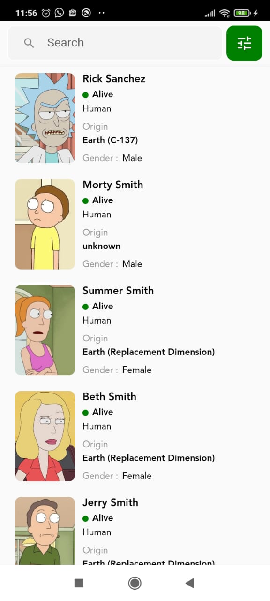

# Rick and Morty App

Latihan parsing API (load more dan filtering) dari API https://rickandmortyapi.com/ menggunakan
State Management Getx serta menggunakan Obx untuk update Widget UI,untuk call API menggunakan
GetConnect bawaan dari Getx

Aplikasi dibuat menggunakan Flutter versi 2.10.5

Selamat Mempelajari dan Semoga bermanfaat :D

ScreenShoot Aplikasi

 
 

